#  
#    🌍 OPTIMISATION DU VOYAGEUR DE COMMERCE (TSP) - METAHEURISTIQUES 
#  

## 🎓 Cadre Académique
* **Établissement :** Université Hassan II de Casablanca – ENSET Mohammedia
* **Master :** SDIA (Systèmes de Données & Intelligence Artificielle) / GESI
* **Module :** Optimisation / Métaheuristiques
* **Encadrant :** Pr. Mohammed MESTARI
* **Année universitaire :** 2025–2026

## 👥 Auteurs
* **Mustapha Elmifdali**
* **Mbarek Etalebi**

---

## 📝 Résumé du Projet

Le TSP est un problème de décision de classe **NP-difficile**. Il consiste à trouver le plus court **cycle hamiltonien** dans un graphe complet pondéré $G = (V, E, w)$ de $N$ sommets (villes).

Formellement, étant donné un ensemble de villes $\mathcal{C} = \{c_0, c_1, \dots, c_{n-1}\}$ et une matrice de distances $D \in \mathbb{R}^{n \times n}$, l'objectif est de minimiser la longueur totale de la tournée :

$$
\text{Minimiser} \quad f(\pi) = \sum_{i=0}^{n-1} d\!\left(\pi_i,\, \pi_{(i+1) \bmod n}\right)
$$

sous la contrainte que $\pi$ est une permutation de $\{0, \dots, n-1\}$, où $d(u, v)$ est la **distance euclidienne** entre les villes $u$ et $v$ :

$$
d(u, v) = \sqrt{(x_u - x_v)^2 + (y_u - y_v)^2}
$$


### Algorithmes Implémentés
Nous avons exploré et comparé quatre approches algorithmiques pour naviguer dans cet espace de recherche discret :
1.  **Hill Climbing (First Improvement)** : Une recherche locale gloutonne qui accepte le premier voisin améliorant trouvé.
2.  **Hill Climbing (Best Improvement)** : Une exploration exhaustive du voisinage immédiat pour choisir la direction la plus prometteuse.
3.  **Recuit Simulé (Simulated Annealing)** : Une métaheuristique stochastique permettant d'accepter des solutions dégradantes selon une probabilité décroissante pour s'échapper des optima locaux.
4.  **Recherche Tabou (Tabu Search)** : Une méthode utilisant une mémoire à court terme (liste tabou) pour interdire les mouvements récents et forcer l'exploration de nouvelles zones.

---

## 📊 Protocole Expérimental
Conformément à la démarche scientifique, chaque algorithme est évalué sur **30 runs indépendants**. Les statistiques extraites permettent d'analyser la convergence, la qualité de la solution (Meilleur coût) et la robustesse (Écart-type).

---

## 📍 Instance 1 : Ulysses20 (20 villes)
Instance de petite taille basée sur l'Odyssée d'Ulysse.

### Statistiques
| Algorithme | Meilleur Coût | Coût Moyen | Écart-Type |
| :--- | :---: | :---: | :---: |
| **HC First Improvement** | 74 | 86.17 | 7.13 |
| **HC Best Improvement** | 72 | 82.30 | 7.28 |
| **Recuit Simulé** | 74 | 86.13 | 7.93 |
| **Tabu Search** | **72** | **74.07** | **3.91** |

### Visualisation des Meilleurs Trajets
| HC First Improvement | HC Best Improvement |
| :---: | :---: |
| 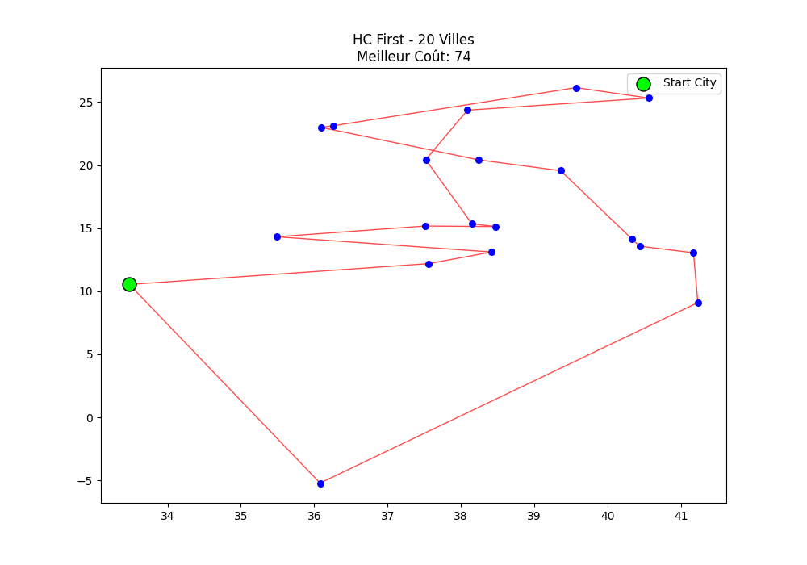 | 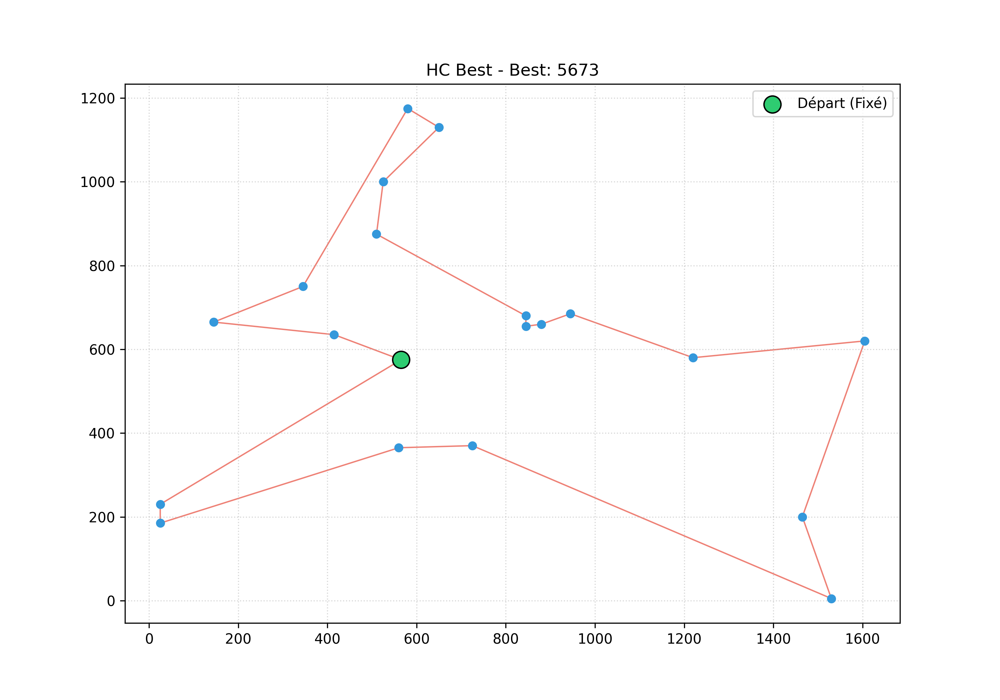 |
| **Recuit Simulé** | **Tabu Search** |
| 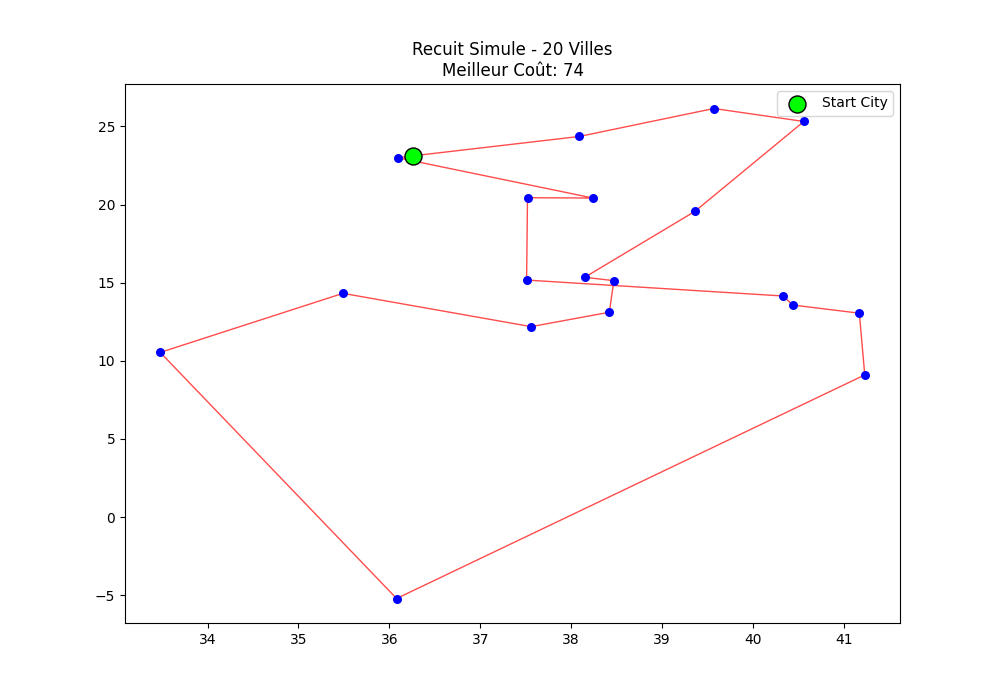 | 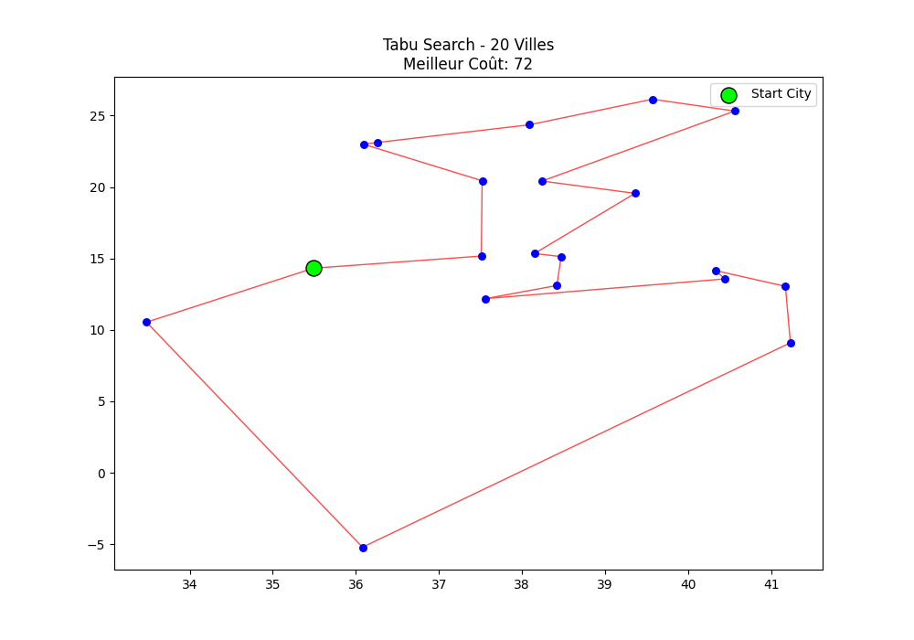 |

**Analyse des Performances :**
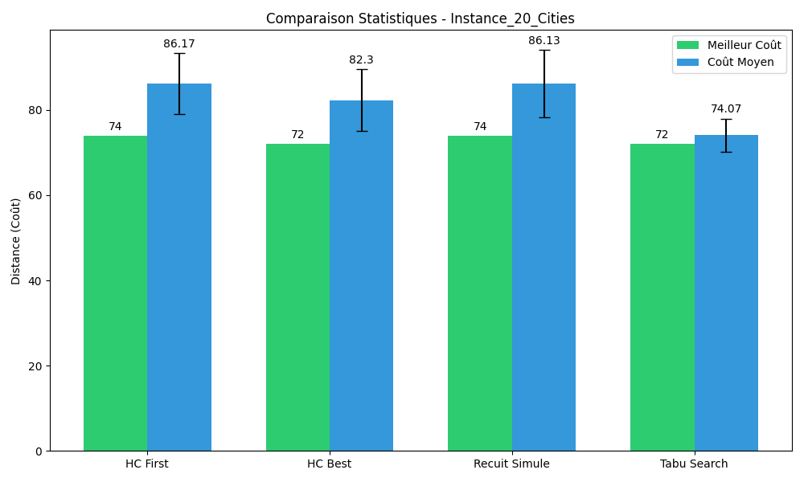

---

## 📍 Instance 2 : Berlin40 (40 villes)
Instance intermédiaire tronquée de Berlin52.

### Statistiques
| Algorithme | Meilleur Coût | Coût Moyen | Écart-Type |
| :--- | :---: | :---: | :---: |
| **HC First Improvement** | 7403 | 8465.30 | 534.34 |
| **HC Best Improvement** | 7833 | 8782.53 | 551.88 |
| **Recuit Simulé** | 9183 | 10425.37 | 719.94 |
| **Tabu Search** | **7317** | **8179.03** | **487.45** |

### Visualisation des Meilleurs Trajets
| HC First Improvement | HC Best Improvement |
| :---: | :---: |
| 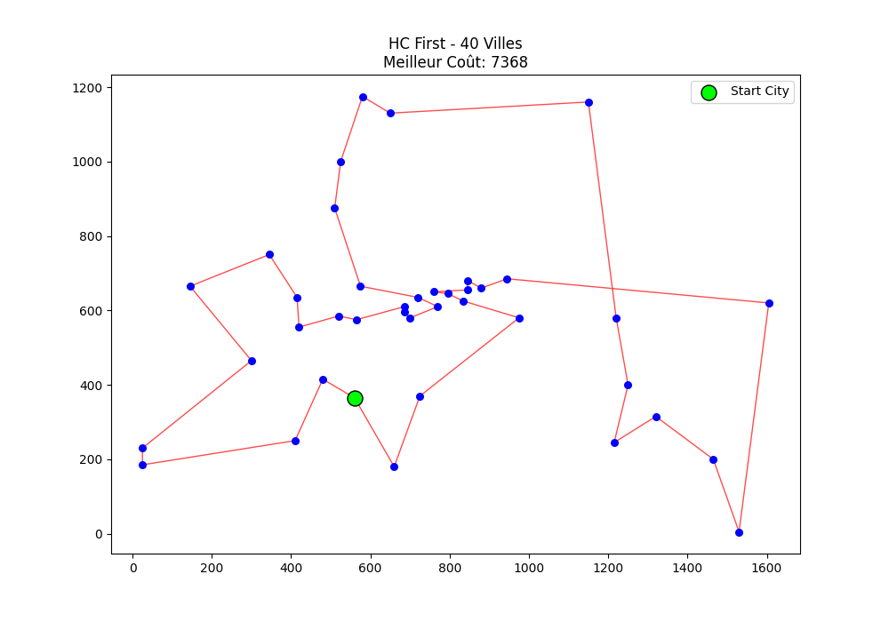 | 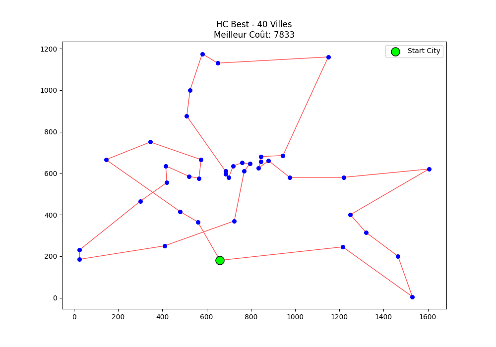 |
| **Recuit Simulé** | **Tabu Search** |
| 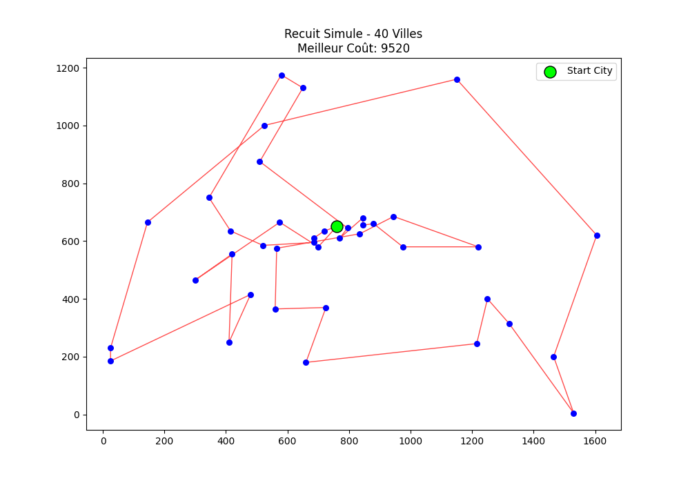 | 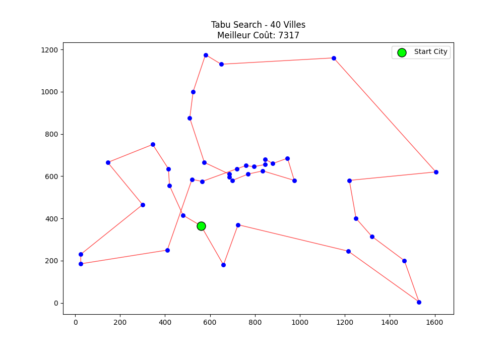 |

**Analyse des Performances :**
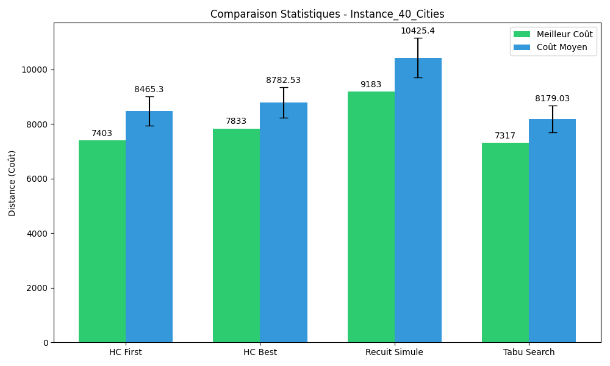

---

## 📍 Instance 3 : Eil80 (80 villes)
Instance à large échelle testant les limites de convergence des métaheuristiques.

### Statistiques
| Algorithme | Meilleur Coût | Coût Moyen | Écart-Type |
| :--- | :---: | :---: | :---: |
| **HC First Improvement** | **11062** | 12862.43 | 977.71 |
| **HC Best Improvement** | 12114 | 13774.70 | 706.93 |
| **Recuit Simulé** | 19327 | 21673.93 | 1319.29 |
| **Tabu Search** | 11556 | 13161.23 | 802.24 |


### Visualisation des Meilleurs Trajets
| HC First Improvement | HC Best Improvement |
| :---: | :---: |
| 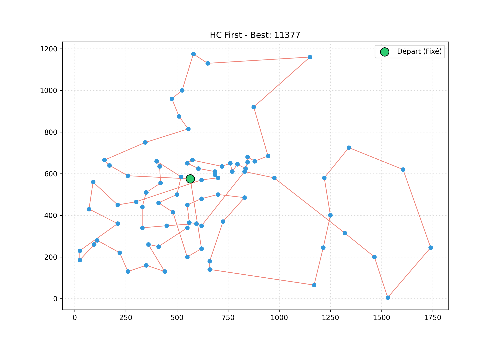 | 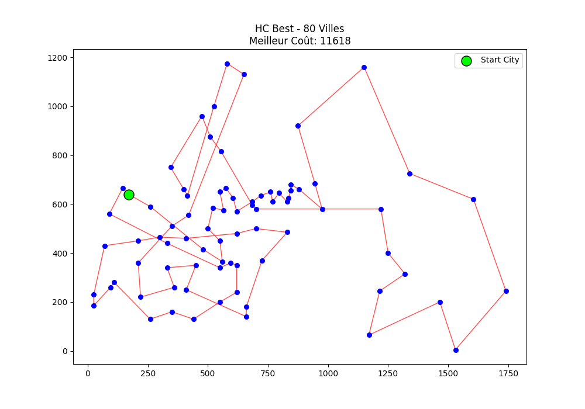 |
| **Recuit Simulé** | **Tabu Search** |
| 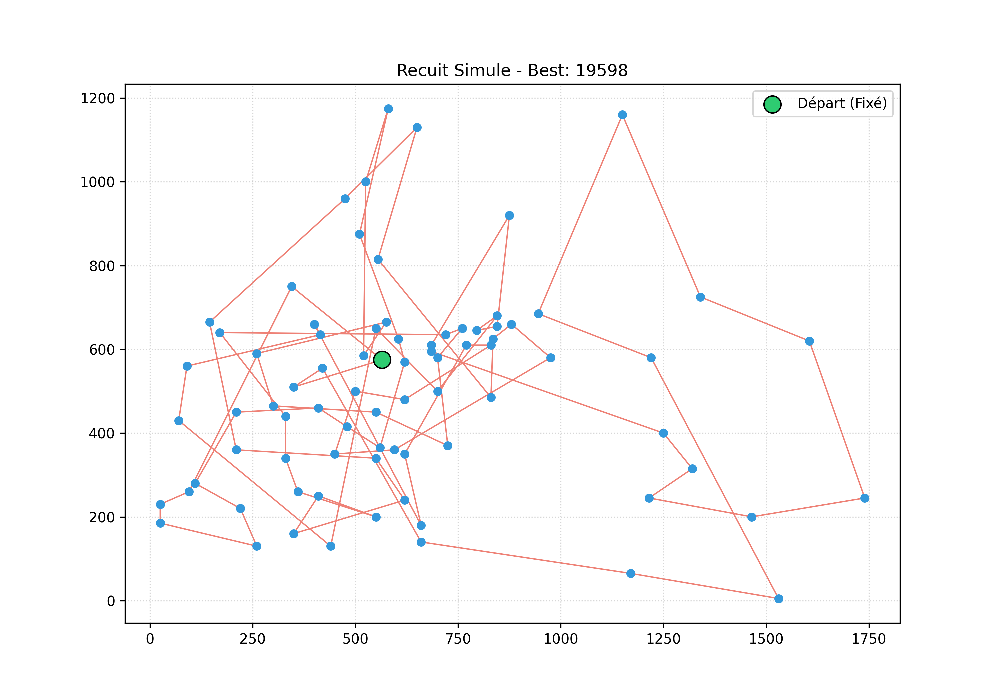 |  |

**Analyse des Performances :**> 
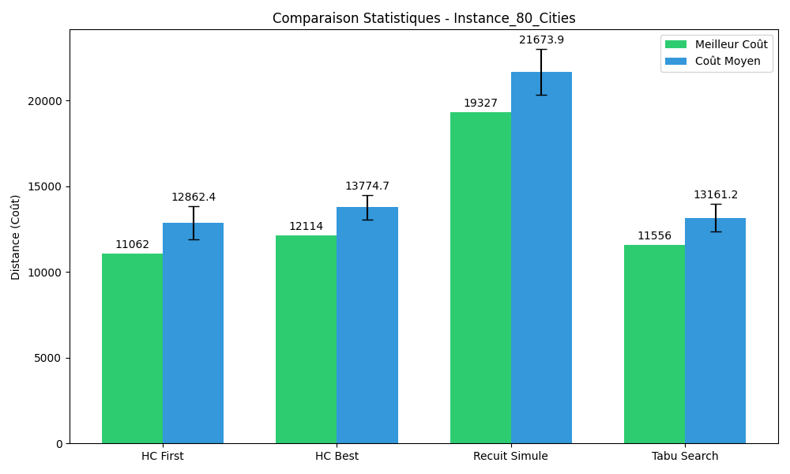 

---

## 🛠️ Structure du Projet
- **`algorithms.py`** : Logique des classes `HillClimbing`, `SimulatedAnnealing`, et `TabuSearch`.
- **`experiment.py`** : Orchestrateur lançant les tests et la génération d'images.
- **`utils.py`** : Fonctions utilitaires (Calculs, Voisinages, Matplotlib).
- **`data_loader.py`** : Module de lecture des fichiers `.tsp`.

## 🚀 Utilisation
1. Installer les dépendances : `pip install matplotlib`
2. Lancer le protocole d'expérimentation :
   ```bash
   python experiment.py